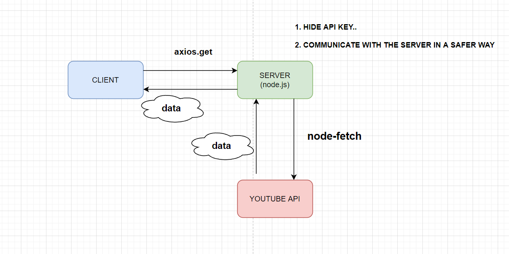

  

  
  
  

  

 

**MeTube** is a web app built with Node.js, Express and
React. Youtube API was used to fetch the
video data. It was fetched from the serverside using node-fetch, so it could hide sensitive information such as the API
secret key.

It clones <a href="https://chrome.google.com/webstore/detail/unhook-remove-youtube-rec/khncfooichmfjbepaaaebmommgaepoid">"Unhook Youtube Extension"</a> to remove YouTube recommended videos on the landing page so the users don't get distracted by them.

  

## Table of Contents

- [Features](#features)
- [Development](#development)
  - [Architecture](#architecture)
  - [Technologies](#technologies)
  - [Useage](#usage)
  - [Configuration](#configuration)
- [Future Updates](#future-updates)
- [Author ](#author)
- [Reference](#reference)

## Features

- Fetch Youtube API from server side.
- Send email that includes JWT for forgot password users

---

## Development

### Architecture

### Technologies

The primary libraries and dependencies used in the development of MeTube are shown below. For a complete list of dependencies, consult the package.json files inside `client` and `server` folders.

| Library                                                  | Purpose                                       | Client or Server? |
| :------------------------------------------------------- | :-------------------------------------------- | :---------------- |
| [React.js](https://reactjs.org/)                         | A JavaScript library for building UIs         | Client            |
| [Axios](https://styled-components.com/)                  | To make 'Get' Http request                    | Client            |
| [Express](https://expressjs.com/)                        | Backend Server Framework                      | Server            |
| [Note-fetch](https://www.npmjs.com/package/jsonwebtoken) | To fetch the youtube API from the server side | Server            |
| [Dotenv](https://expressjs.com/)                         | To hide API secret key                        | Server            |

### Usage

| (1) Commands (`/client`) | Purpose                        |
| :----------------------- | :----------------------------- |
| `npm run start`          | Run Frontend Production Server |
| `npm run dev`            | Run Frontend Locally           |
| `npm run build`          | Build Frontend for Production  |

| (2) Commands (`/server`) | Purpose                           |
| :----------------------- | :-------------------------------- |
| `npm start`              | Run Backend Server                |
| `npm run dev`            | Run Backend locally using Nodemon |

### Configuration

| Location         | Purpose                           |
| :--------------- | :-------------------------------- |
| `/client`        | Frontend source directory         |
| `../components`  | App Components (React)            |
| `../public`      | Static Assets                     |
| `/server`        | Backend source directory          |
| `../controllers` | MongoDB/Mongoose Data Controllers |
| `../routers`     | MongoDB/Mongoose Data Routers     |

---

## Future Updates

- Add React Infinite Scroll

- Dynamic pages so the app can go back and forth the page like Youtube

---

## Author

- Ryan Park[[Portfolio](https://www.ryanbest99.com/)] [[LinkedIn](https://www.linkedin.com/in/ryanbest99/)]

---

## Reference

- Making Http Requests in Node.js [[stackabuse](https://stackabuse.com/making-http-requests-in-node-js-with-node-fetch/)]

- How To Use Axios With React: The Definitive Guide [[Freecodecamp](https://www.freecodecamp.org/news/how-to-use-axios-with-react/)]

- Use Async/Await with Axios in React.js [[Freecodecamp](https://stackoverflow.com/questions/46733354/use-async-await-with-axios-in-react-js)]
